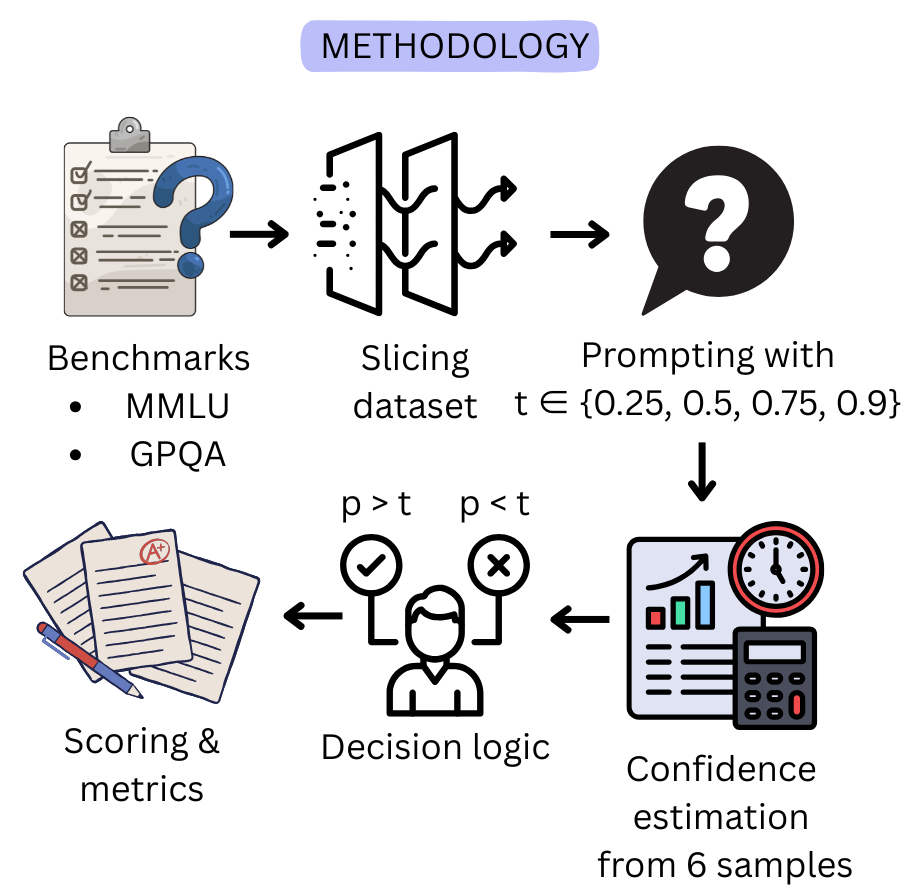

## Re-Scoring Language Model Benchmarks with Explicit Confidence Targets
Veer Kejriwal · Stuti Singhal · Raima Nawal · Shubhangi Asthana

Georgia Institute of Technology


### Overview
This repository contains our full pipeline for evaluating large language models under confidence-aware scoring. Instead of relying on binary accuracy which gives equal credit to confident mistakes and genuine uncertainty, we evaluate models only when they self-report confidence above a threshold t, and penalize them proportionally when confidently wrong. This approach reveals reliability failures, calibration gaps, and misleading leaderboard rankings that binary grading masks.

Directory structure:

```text
llm-eval/
├─ assets/                 # Figures used in the paper
├─ data/                   # Processed benchmark splits (MMLU, GPQA)
├─ inference/
│  ├─ code/                # Notebooks for running model inference
│  └─ outputs/             # Raw model answer output
├─ eval/
│  ├─ outputs/             # Scored metrics for each model/dataset
│  └─ *.ipynb              # Notebooks for confidence-aware evaluation
├─ data_visualization.ipynb# Plots and summary visualizations
└─ README.md
```

### Motivation
Modern LLMs still hallucinate, especially under pressure to answer everything. Standard benchmarks such as MMLU and GPQA grade each question as correct/incorrect with no penalty, which rewards guessing and inflates performance. Our goal is to introduce a lightweight, dataset agnostic scoring rule that rewards calibrated abstention and exposes overconfident errors directly on existing benchmarks.

### Methodology

  

1. Confidence-Aware Prompting. 
  Each model receives the instruction:
  “Answer only if you are more than t confident. Mistakes incur t/(1−t) points; correct = +1; IDK = 0.”
  This enforces calibrated answering without modifying model weights.
2. Model-Agnostic Confidence via Self-Consistency
  For each question, we run multiple independent generations (typically 6–20) and compute confidence as the vote fraction of the majority answer.
  This works uniformly for API models and open-weight models
3. Thresholded Answering
  A model answers only when p > t. Otherwise it abstains.
  We evaluate at four thresholds:
  t ∈ {0.25, 0.50, 0.75, 0.90}
4. Confidence-Proportional Scoring
  If p > t, answers are scored as:
  • +1 for correct
  • − p·t / (1−t) for incorrect
  • 0 for abstentions
  This amplifies penalties for unjustified certainty.

### Benchmarks
We evaluate on two major multiple-choice benchmarks:
MMLU – broad 57-domain knowledge benchmark
GPQA – graduate-level reasoning benchmark (40-question evaluation split used here)
To ensure reproducibility, both datasets are converted to a shared template used by every model.

### Models Evaluated
We evaluate six instruction-tuned LLMs across both datasets:
API Models
1. GPT-4o-mini
2. Claude-Haiku
3. Gemini 2.5 Flash-Lite
Open-Weight Models
1. Llama-3.2-3B
2. Mistral-7B-Instruct
3. Qwen2.5-1.5B-Instruct
All models use the same prompt template and confidence estimation pipeline.

### Key Metrics Reported
Each model–threshold pair reports:
1. Accuracy@t – accuracy on answered questions
2. Coverage – fraction of questions answered
3. Penalty-Adjusted Mean Score – overall performance
4. Overconfidence Rate – incorrect answers with p > t
These metrics expose how often models answer with unjustified confidence, not just how often they are correct.
